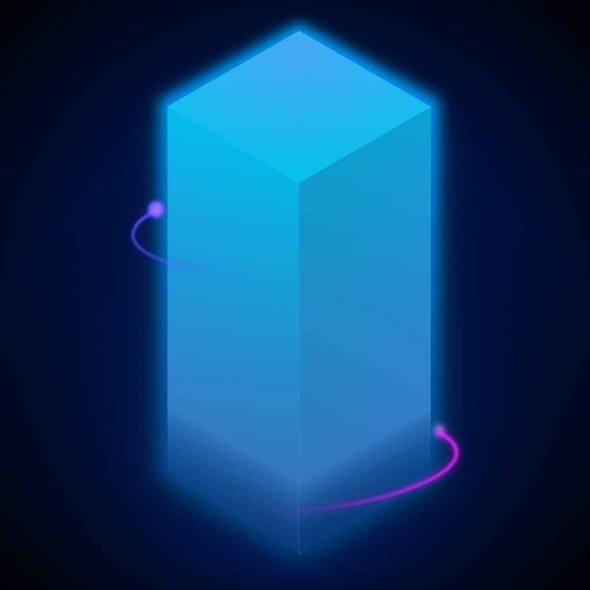
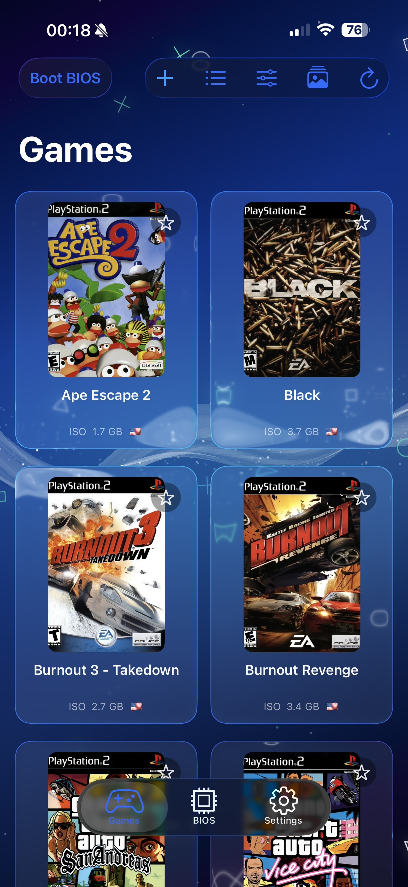
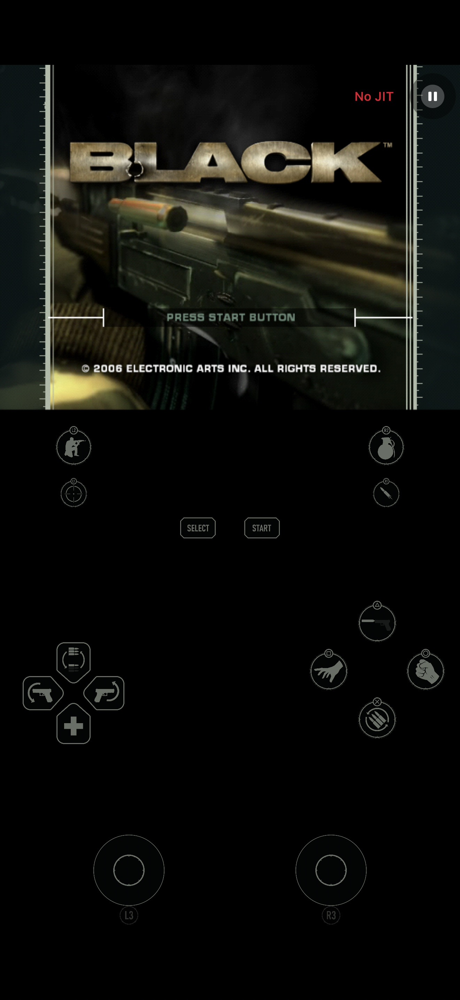
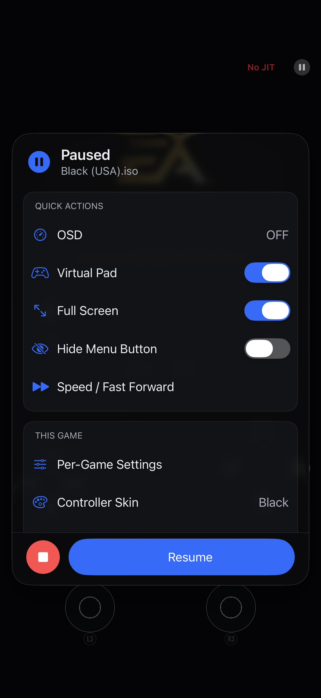
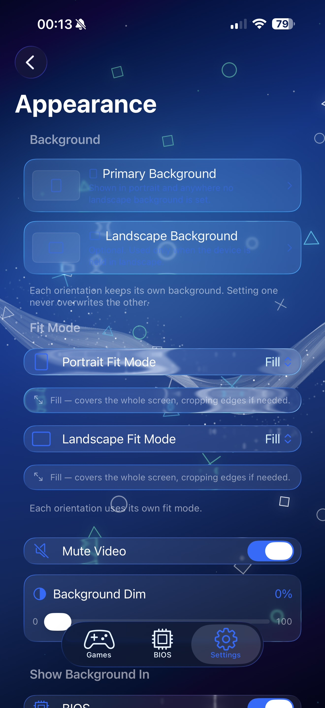

<div align="center">



# ARMSX2 iOS

**PlayStation 2 games on iPhone and iPad.**

The install source for [ARMSX2](https://armsx2.net) on iOS.<br>
Add it once, and your sideloader keeps the app up to date.

<br>

[](https://ios.armsx2.net)

</div>

## Add the source

Open [ios.armsx2.net](https://ios.armsx2.net) on your iPhone or iPad and pick your sideloader. LiveContainer, SideStore and Feather each get a button that hands the source straight over.

Those buttons only work on the device itself, so if you are reading this on a computer, paste the URL in by hand instead:

```text
https://ios.armsx2.net/apps.json
```

## What it looks like

<div align="center">

<table>
  <tr>
    <td align="center"><br><sub>Library</sub></td>
    <td align="center"><br><sub>In game</sub></td>
    <td align="center"><br><sub>Pause menu</sub></td>
    <td align="center"><br><sub>Appearance</sub></td>
  </tr>
</table>

</div>

## Before you start

- **iPhone or iPad on iOS 17 or later, with JIT.** Without JIT the emulator falls back to an interpreter and most games are too slow to play.
- **Bring your own PS2 BIOS and your own game files.** Neither ships here, and neither is linked from here.
- **Not every game runs.** How well one does depends on your device, your iOS version and the game. Some are perfect, some are slow, some do not boot — the [compatibility list](https://armsx2.net/compatibility) is worth a look first.

## Two channels

|  | **ARMSX2 iOS** | **ARMSX2 Nightly** |
| --- | --- | --- |
| What it is | The released build | The latest code, built automatically |
| How often | When upstream ships one | Most days |
| Testing | Release testing | Less than a release gets |
| Pick this if | You want to play | You want new features early |

Both live in the same source, so adding it once gets you both. The nightly appears once one has been mirrored.

They use different bundle identifiers, which means they install as two separate apps with separate save states, memory cards and settings. Installing a nightly cannot disturb a stable install, and the two never share data. Different icons and tint colours, too, so you can tell them apart in a list.

## Links

- [armsx2.net](https://armsx2.net) — builds for other platforms, docs and the FAQ
- [Compatibility list](https://armsx2.net/compatibility) — check a game before you start
- [Discord](https://discord.gg/S7VxwfS8w9) — where to ask when something breaks
- [ARMSX2 source code](https://github.com/ARMSX2/ARMSX2) — GPL-3.0
- Support development on [Patreon](https://www.patreon.com/cw/ARMSX2) or [Ko-fi](https://ko-fi.com/armsx2)

---

<details>
<summary><b>Working on this repo</b></summary>

<br>

`apps.json` and `checksums.json` are generated, never edited by hand. `npm run check:source` fails if they drift from what the tooling would produce.

| Command | What it does |
| --- | --- |
| `npm run generate:source` | Rebuild `apps.json` and `checksums.json` |
| `npm run check:source` | Fail if the generated files are stale |
| `npm run validate:source` | Schema, asset, IPA and ledger checks |
| `npm run sync:upstream` | Publish the newest upstream stable iOS release |
| `npm run mirror:nightly` | Mirror the newest upstream nightly iOS build |
| `npm run smoke:live` | Check the published site against what it claims |
| `npm test` | Unit tests |

### How the scripts fit together

Entry points are named verb-first, the libraries they pull in are named noun-first. That holds for every file in `scripts/`.

| Script | Run by |
| --- | --- |
| `generate-source.js` | `npm run generate:source` and `check:source` |
| `validate-source.js` | `npm run validate:source` |
| `sync-upstream-ipa.js` | `npm run sync:upstream`, and the update workflow |
| `mirror-nightly.js` | `npm run mirror:nightly`, and the nightly workflow |
| `prune-nightly.js` | The nightly workflow — reads filenames on stdin, prints the ones safe to delete |
| `smoke-live.js` | `npm run smoke:live` |

The pieces they use:

- `source-builder.js` assembles `apps.json` and `checksums.json`. `source-news.js` builds the news items. `source-schema.json` is the shape `validate-source.js` enforces.
- `ipa-metadata.js` reads an IPA: version, size, hash and the permissions it declares.
- `nightly-releases.js` finds upstream nightly builds. `nightly-ipa.js` repacks one so it installs beside the stable app.
- `legacy-references.js` scans the repository for strings left over from the old hosting setup, and is the reason `validate:source` touches files that have nothing to do with `apps.json`.
- `github-releases.js` and `github-assets.js` are the only things that talk to GitHub. `github-releases.js` also turns a release body into store text.
- `cli.js`, `constants.js`, `errors.js` and `source-utils.js` are the small shared pieces — argument parsing, the canonical URLs and bundle identifiers, typed errors, and JSON and URL helpers.
- Tests live in `scripts/tests/`. `npm test` runs `scripts/tests/*.test.js` on Node 22 or later.

### Where the content lives

Listing copy lives in `metadata/`, not in code. `metadata/store.json` holds the stable app and the source header; `metadata/nightly.json` holds the nightly app and the ledger of mirrored builds. Assets live in `assets/` — `icon.png` for stable, `icon-nightly.png` for nightly, and the screenshots both channels share. `index.html` is the page served at the root of the site; it is hand-written and has no build step.

### Assets

Published image URLs carry a `?v=<hash>` fingerprint taken from the file's own
contents. The edge caches assets for years under a stable filename, so without it a
replaced icon or screenshot keeps serving the old bytes — which is exactly what
happened to `assets/icon.png`. `index.html` spells its fingerprints out by hand, and
`validate:source` fails if they drift from the files.

### Releases and news

Release notes open with a link to the upstream release, because sideloaders preview only the first few lines and that link is the most useful thing to put there. Notes are written once and then left alone, so an edit to an upstream release body cannot make an unrelated push fail `check:source`. Run `npm run generate:source -- --refresh-changelogs` to deliberately re-pull them.

`apps.json` also carries a `news` array. Sideloaders render those as cards above the app list, one per iOS release plus the newest nightly, newest last because the carousel draws them back to front. When GitHub cannot be reached the already-published news is kept, so an unauthenticated CI run does not rewrite the file.

Stable builds are committed to `ipas/` and their versions come from the IPA's own `CFBundleShortVersionString`. Nightly builds are mirrored straight to the server and recorded in `metadata/nightly.json`; the binaries are never committed, and `retain` in `metadata/nightly.json` decides how many are kept.

</details>

---

<div align="center">
<sub>

ARMSX2 is open source under GPL-3.0 and builds on PCSX2. It is not officially associated<br>
with PCSX2, and not affiliated with Sony Interactive Entertainment or PlayStation.

</sub>
</div>
